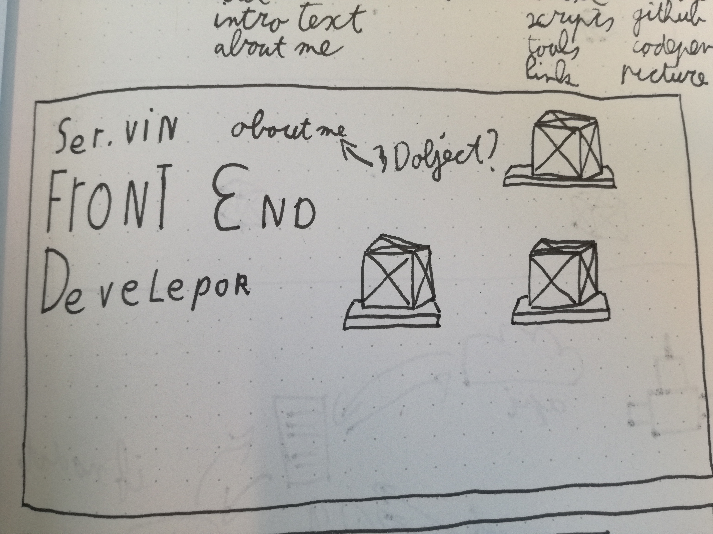
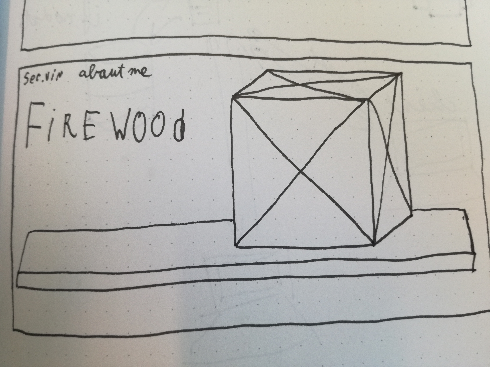

# Web design

This repository is for the subject web design as part of the minor Web Development on the HvA.

For this project I designed a new portfolio specifically for 2 users. The first being Marijn. He was born spastic, this means that most (if not all) of his web use is done through the keyboard. The second is someone who is interested in hiring me as intern.

### User scenario

As `$user` i want to see the projects in there right context.

`$user`

- Three.js / WebGL developer
- Inter suppervisor
- Front end developer

### Purpose of the website

- To get an internship in 3D within the web
- To leave a good impression of my work
- To have them contact me

### Content 

- 2D
- 3D
- Home page title
- Home page intro
- About me
- Project
	- Purpose
	- Scripts used
	- Tools
	- Link to project
	- Dribbble
	- Github
	- Codepen
	- Pictures

### Sketches

